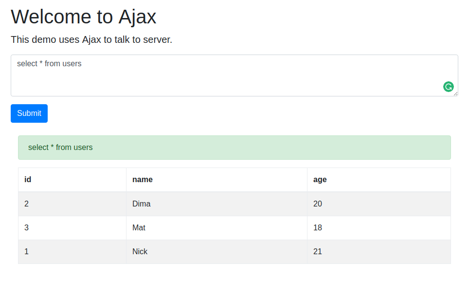
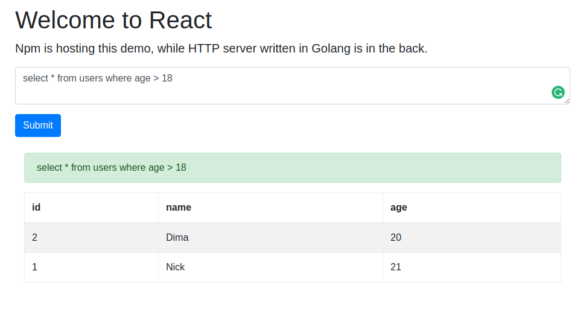
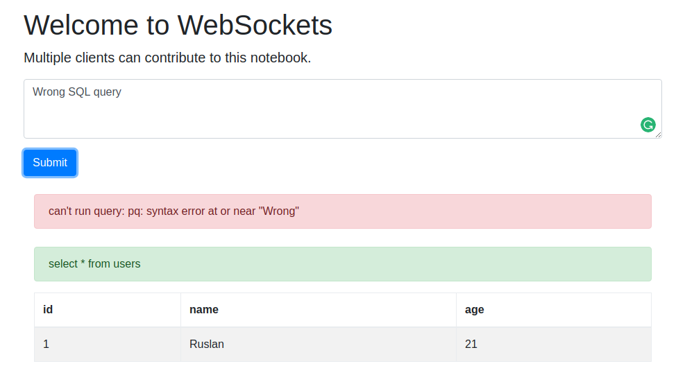

# PgApps

[](https://travis-ci.org/lionell/pgapps)

This repository contains different ways to interact with database. From simple CLI to colab notebook based on [WebSocket](#websockets), deployed to the cluster.
All of these are **demos** and are not designed to be used in production.

## How it works

All the interactions with database is done via
```go
type Engine interface {
	Open() error
	OpenRemote(host, port string) error
	Close()
	Exec(query string) (*Table, error)
}
```
So that you can easily substitute database backend with anything you want(eg. [Aqua](aqua)).

## CLI

`cli` is a very simple [Command Line Interface](cli-wiki) for database.

After you run the tool, you'll be welcomed with a prompt.
Just type the query you want to run and press enter. It will be executed on the backend, and you'll see the nicely formatted results.
To close the tool just enter `exit`.

```bash
$ go run cmd/cli/cli.go
> select * from users
   id     name   age
    1   Ruslan    21
    2     Dima    20
    3      Mat    18
```

## RPC

`client` and `server` tools use [Remote Procedure Calls](rpc-wiki) to communicate.

User interface is pretty much the same as in the [CLI](#cli) version.
To start server just run

```bash
$ go run cmd/server/server.go -port 1234
2017/11/29 03:10:30 Listening on port 1234
...
```

Then you can connect via client

```bash
$ go run cmd/client/client.go -host localhost -port 1234
Connection to localhost:1234 established.
> select * from users
   id     name   age
    1   Ruslan    21
    2     Dima    20
    3      Mat    18
```

## REST API

`rest` tool exposes [REST API](rest-api-wiki) for database.

To use it, we need to start server

```bash
$ go run cmd/rest/rest.go -port 8080
2017/11/29 03:19:41 Running server on port 8080.
...
```

Server can serve queries to any table in the database.
Different tables are exposed as a different REST resources.

Here is how you can make a request

```bash
$ curl http://localhost:8080/users/1
{
  "header": [
    "id",
    "name",
    "age"
  ],
  "rows": [
    [
      "1",
      "Ruslan",
      "21"
    ]
  ]
}
```

This table shows how to make other REST calls, and whether you need to specify JSON data in request.

| Action       | Method | Pattern       | Data |
|:-------------|:-------|:--------------|:-----|
| Get all      | GET    | {table}       | No   |
| Get by ID    | GET    | {table}/{id}  | No   |
| Add new      | POST   | {table}       | Yes  |
| Update by ID | PUT    | {table}/{id}  | Yes  |
| Remove by ID | DELETE | {table}/{id}  | No   |

For example if we want to update name for a user with `id=1` we can do it this way

```bash
$ curl -X PUT --data '{"header":["name"],"rows":[["Nick"]]}' http://localhost:8080/users/1
$ curl http://localhost:8080/users/1
{
  "header": [
    "id",
    "name",
    "age"
  ],
  "rows": [
    [
      "1",
      "Nick",
      "21"
    ]
  ]
}
```

## Ajax

`ajax` tool is using [Ajax](ajax-wiki) requests to communicate with server.

After you start the server, you can use user-friendly frontend to query database.

```bash
$ go run cmd/ajax/ajax.go -port 8080
2017/11/29 03:46:23 Running server on port 8080.
...
```

If you navigate to `localhost:8080` on the same machine, you should see something like



When you type a query and press enter, a new Ajax request is sent to server. After it's processed,
result will be nicely displayed on the web page.

## React

This demo frontend is based on [React](react).

First we need to start the backend server

```bash
$ go run cmd/http/http.go -port 8080
2017/11/29 04:07:14 Running server on port 8080.
...
```

Then we use [NPM](npm) to start serving frontend

```bash
$ npm start --prefix react

Compiled successfully!
The app is running at:
  http://localhost:3000/
...
```

This should serve a page on port `3000` and automatically open a browser tab with it



Functionality is the same as for [Ajax](#ajax).

## WebSockets

Here we are using [WebSockets](websocket-wiki) to build colaboratory notebook.

To use `websocket` tool just start the server

```bash
$ go run cmd/websocket/websocket.go -port 8080
2017/11/29 04:18:56 Running server on port 8080.
...
```

Now everybody can connect on this port and run queries against your database. What's new here, is that **everybody will
see queries and results of others**. It's like Google Docs but for queries :)

User-experience is pretty much the same as for [React](#react) and [Ajax](#ajax).

## Kubernetes

### Building Docker image

There is a `Dockerfile` in the root of the repo that you can use to build [Docker](docker) image
for modified version of [WebSockets](#websockets) app. Default version assumes that we have [PostgreSQL](postgresql)
running locally. Here you can specify where database is located.

To build an image and push it to [Docker Hub](docker-hub) just do

```bash
$ docker build -t lionell/websockets:v1 .
...

$ docker push lionell/websockets:v1
```

Now you can find image linked to your account(you should substitute 'lionell' in the commands above).

### Kubernetes on GCP(optional)

Let's start a new [Kubernetes](kubernetes) cluster with 3 nodes on [Google Cloud Platform](gcp).

```bash
$ gcloud container clusters create websockets-cluster --num-nodes=3
```

Now you should be able to see 3 nodes if you run

```bash
$ gcloud compute instances list
```

For more information see [Deploying a containerized web application tutorial](kubernetes-tutorial).

### Deploying to Kubernetes cluster

We are going to use preconfigured Kubernetes resource files located in `kubernetes/` to create services
and deployments.

These commands will deploy PostgreSQL database to Kubernetes

```bash
$ kubectl create -f kubernetes/my-postgres-service.yml
$ kubectl create -f kubernetes/my-postgres.yml
```

Then we need to deploy our application. Deployment file `kubernetes/app.yml` uses Docker image `lionell/websockets:v1`
to create container

```bash
$ kubectl create -f kubernetes/app-service.yml
$ kubectl create -f kubernetes/app.yml
```

Let's find external IP address GCP issued to load balancer

```bash
$ kubectl get svc/app
NAME          TYPE           CLUSTER-IP      EXTERNAL-IP      PORT(S)        AGE
app           LoadBalancer   10.43.251.48    35.202.209.153   80:31914/TCP   2m
```

In my case it's 35.202.209.153. So if I open it in the browser, I'll see my app. Hooray!



### Application scaling

You can easily scale an application with Kubernetes. For example we can scale our `app` deployment like this

```
$ kubectl scale deployment/app --replicas 2
```

This will create 2 different pods for our service, and all the ingress traffic will be load balanced between
the pods. In our particular case, **scaling is not useful**, as we'll loose ability to communicate query results
to other users(that hitted different endpoint).

### New version rollout

We can easily rollout a new version of an application with Kubernetes

```bash
$ kubectl set image deployment/app app=lionell/websockets:v2
```

This will sequentually turn down each replica in deployment and replace it with a new version. So that your application can function during the update.

### Cleaning up(optional)

Don't forget to **shut your cluster down**.

```bash
$ kubectl delete service app
$ gclould container clusters delete websockets-cluster
```

## License

MIT

[aqua]: https://github.com/lionell/aqua
[cli-wiki]: https://en.wikipedia.org/wiki/Command-line_interface
[rpc-wiki]: https://en.wikipedia.org/wiki/Remote_procedure_call
[rest-api-wiki]: https://en.wikipedia.org/wiki/Representational_state_transfer
[ajax-wiki]: https://en.wikipedia.org/wiki/Ajax_(programming)
[react]: https://reactjs.org
[npm]: https://www.npmjs.com
[websocket-wiki]: https://en.wikipedia.org/wiki/WebSocket
[docker]: https://www.docker.com
[docker-hub]: https://hub.docker.com
[kubernetes]: https://kubernetes.io
[gcp]: https://cloud.google.com
[kubernetes-tutorial]: https://cloud.google.com/kubernetes-engine/docs/tutorials/hello-app
[postgresql]: https://www.postgresql.org
